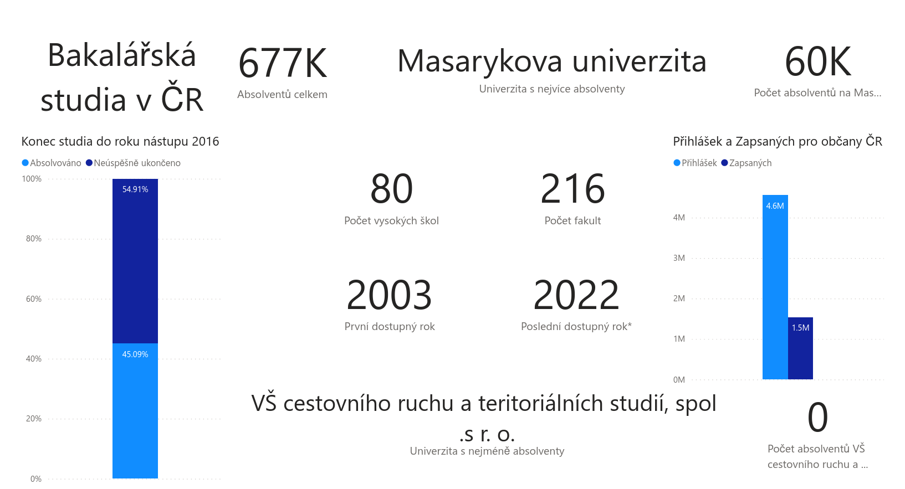
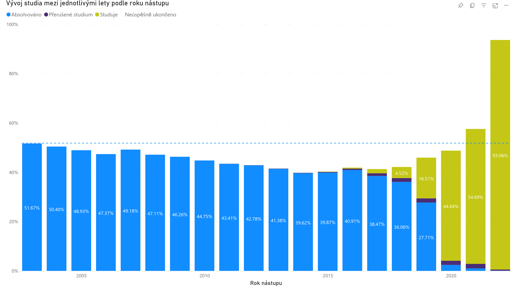
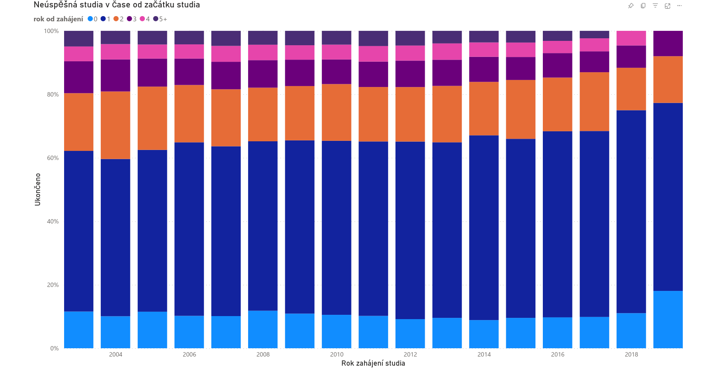
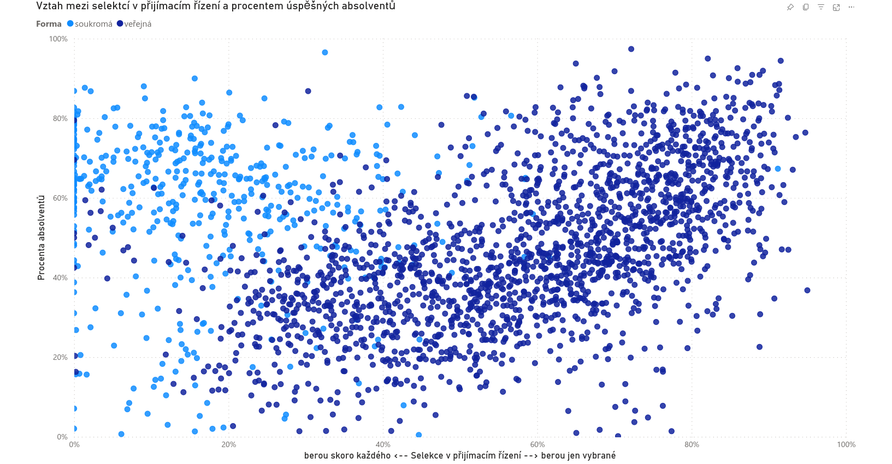

# ZDA semestrální práce
V semestrální práci analyzuji souvislost mezi selekcí v přijímacím řízení a úspěšností bakalářského studia v České republice mezi lety 2003 až 2016.  

Potřebné hodonoty jsem dopočítával v Power Query a PowerBi. Python scripty byly použité na scrapování stránek a základní statistickou analýzu.

## Motivace
O technických VŠ se mezi lidmi a mými kamarády traduje, že naberou mnoho studentů a pak je během studia vyhází. Naopak sociální vědy, medicína mají údajně málo přijatých a velké procento absolventů.

Ve svojí semestrální práci zkusím ověřit tuto lidovou hypotézu.

## Datový podklad
Jako datový podklad používám data ministrstva školství. V klikací podobě jsou veřejně dostupná v aplikacích [neúspěšnost](https://statis.msmt.cz/statistikyvs/neuspesnost.aspx) a [uchazeč](https://statis.msmt.cz/statistikyvs/uchazecVS.aspx). Tato podoba je ale pro jakoukoli práci s daty nevhodná.

Tabulku pro neúspěšnost jsem tedy získal emailem od Jana Hraby (správce klikací aplikace) a tabulku o uchazečích selenium scrapováním aplikace uchazeč. Z těchto dvou podkladových tabulek jsem následně vycházel a postavil na nich veškeré svoje vizualizace a úvahy.

Vlastností dat je určitá nekonzistence - uchazeči jsou evidováni jen pro občany ČR a neúspěšnost je evidovaná pro všechny, včetně cizinců

## Deskriptivní analýza
Základní informace o datasetu:

Vývoj absolvování. Je zřejmé, že procento úspěšných absolventů klesá.

Na grafu o vývoji úspěšnosti si zaslouží komentář žlutí studující na pravé straně. Tito lidé tvoří 1.72% i v roce 2017 (to znamená 5 let bakaláře!). V hledání souvislostí by uměle snižovali počty absolventů a proto jsem se rozhodl pracovat jen s roky <= 2016.  

Další graf ukazuje roky od zahájení během kterých došlo k neúspěšnému ukončení studia. Jeho obsah je ale trochu zavádějící - údaje o ukončení jsou evidovány k 31.12. daného roku.

__0__ odznačuje ukončená studia části 1. semestru. __1__ zahrnuje studia, ukončená ve zkouškovém 1. semestru, kdykoli během 2. semestru, prázdnin a části 3. semestru. A tak dál.

Z dat proto nejde jednoznačně určit, ve kterých ročnících studia končí nejvíce studentů. Lze jenom konstatovat, že nejvíc studentů končí v 1. - 3. semestru.

Tento graf je zajímavý i tím, že se v obdobné podobě objevuje i ve zveřejněných publikacích na internetu, které si zavádějícího rozdělení nevšímají (viz. články v sekci __Názory expertů__.)

## Statistická analýza
__Selekci__ v přijímacím řízení jsem si pro svoje potřeby zadefinoval jako % osob, které NEzvládnou přijímací řízení (tj. _1 - (zahájená studia / "živé" přihlášky)_)

__Procento absolventů__ je už standartně zadefinované jako _počet absolventů v roce 2022 / počet započatých studií_.

Tyto údaje jsem spočítal pro každou fakultu a každé její příjímací řízení (jedno za rok).
 
Data jsem ještě vyfiltroval, aby splňovala následující podmínky:

- počet studií >= 25
- rok nástupu <= 2016
- procento absolventů != 0%
- selektivita != 100%

Filtry nezachycují soukromé školy, které ukončili svůj provoz. Ty mají následně v grafu velmi nízkou průchodnost.

Z grafu je patrné:

- výrazné rozdělení na soukromé a veřejné vysoké školy
- na soukromé vysoké školy je snažší se dostat
- okometrická korelace u veřejných vysokých škol
- smutné extrémy v podobě jednotek procent absolventů u některých VŠ

### Spočítané metriky
Pearsův korelační koeficient (PCC) vyšel pro data následovně:

`Pro všechny školy:  0.17491`  
`Pro soukromé:		 -0.06575`  
`Pro veřejné:		 0.55370`

U veřejných vysokých škol potvrdil okometrickou korelaci.

### Kauzalita?
Kauzální vztah mi přijde neintuitivní a bylo by u něho k zamyšlení i co je závislá a nezávislá proměnná. Posuďte následující úvahy:

- _vysoká selekce -> dostanou se jen inteligentní a snaživý -> nemusí se vyhazovat_  
  - Jelikož vede vysoká selekce k menší šanci na přijetí, nevede i k méně podaným přihláškám - nevzdá to někdo už rovnou?
  - Lidé mohou podat více přihlášek, jaký to má vliv?  

- _vyhazuje se -> špatná pověst -> malý zájem -> nízká selekce_ 
  - Jak velký vliv hraje procento absolventů u uchazečů při výběru VŠ? Školy a populární materiály ho moc nezveřejňují. Navíc se mezi lidmi šíří spíš subjektivní náročnost - Jaderka těžká, TF ČZU lehké a obě mají přitom stejně nízkou průchodnost.

Obě dvě veličiny mohou být ještě k tomu závislé na nějaké třetí proměnné jako kvalita školy nebo přístupu a zvyku vedení, navázaných na zaměření (medicína, humanitní obor, technika, ...). 

## Názory expertů
Téma neúspěšnosti je odborně zpracované v publikaci *Studijní neúspěšnost na vysokých školách: Teoretická východiska, empirické poznatky a doporučení*. Jeho shrnutím je článek na [perpetuum](https://perpetuum.cz/2018/01/studijni-neuspesnost-na-vysokych-skolach-nejvyssi-cas-na-zmenu/).

Jedním z 6 opatřeních, které autoři doporučují je právě úprava přijímacího řízení:

- _opatření v oblasti přijímacího řízení (typicky úprava testů a kritérií tak, aby dokázaly lépe předvídat úspěšnost studentů)_

Nejedná se podle nich ale o jediný určující faktor a v závěru upozorňují na další důležitou proměnou - konzervativní/moderní pojetí úlohy vysokoškolského vzdělání.

Další, už méně odborné články, jsou na webu [irozhas.cz](https://www.irozhlas.cz/zpravy-domov/data-univerzity-vysoke-skoly-bakalar-studijni-neuspesnost_1805290616_jab) (2018) a 
[idnes.cz](https://www.idnes.cz/zpravy/domaci/vysoka-skola-studijni-neuspesnost-ukonceni-studia.A200121_100045_domaci_knn) (2020).

## Reflexe
Pokud bych dělal projekt znovu, tak bych dělal následující jinak:

1. Nejdříve bych se podíval na názory expertů. Na základě jejich postřehů by šlo definovat více proměných, které průchodnost ovlivňují. Zvýšila by se tak šance na hodnotnější závěr, ze kterého by mohly plynou i zajímavá doporučení pro fakulty s mimořádně nízkou průchodností.  
(Je samozřejmě otázka, jestli by se daly získat taková data. Abstraktní myšlenky jako konzervativního/moderního pojetí VŠ vzdělání se zjišťují obtížněji než čísla o studentech.)
2. Ztrávil bych méně času na části vizuální analýzy o průchodnostech ČVUT, která s cílem práce přímo nesouvisí. Jsou sice vděčné jako ukázka spolužákům (ty jo, FIT má průchodnost jen okolo 25% 😳), ale ušetřený čas by se dal lépe využít.  
Tato práce je v souboru _nefinalni.pbix_ a není úplně vyleštěná.  

## Závěr
U bakalářského studia na veřejných vysokých školách skutečně existuje korelace mezi selekcí v přijímacím řízení a procentem úspěšných absolventů. Kauzální vztah ale nebyl prokázán, spíše jsou obě veličiny společně závislé na dalších proměnných.

Zkrátka, jako uchazeč můžete očekávat, že když se při přijímačkách zapotíte, tak se vás škola nebude snažit tolik vyhodit.